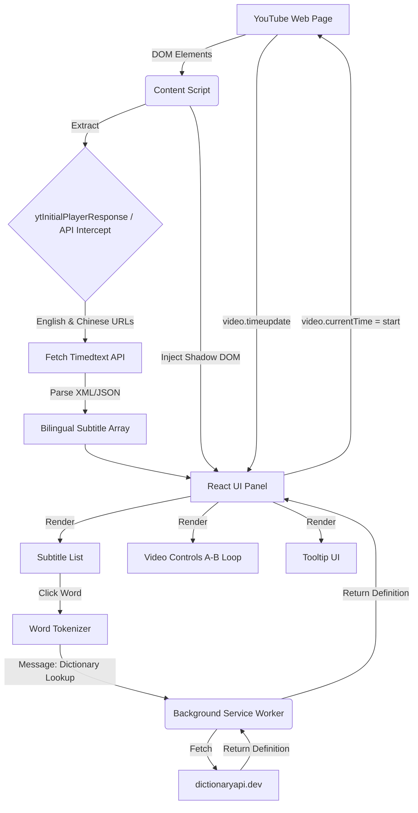

# Architecture Plan: YouTube Language Learning Chrome Extension

## Overview
This document outlines the architecture for the YouTube Language Learning Chrome Extension (Manifest V3). The extension will overlay a bilingual subtitle reader on YouTube, featuring dictionary lookup, A-B repeat, and video synchronization.

## Tech Stack
- **Framework:** Vite + TypeScript
- **UI:** React
- **Styling:** Tailwind CSS
- **Extension Tooling:** `@crxjs/vite-plugin` (recommended for seamless MV3 development)

## Component Diagram

## Key Mechanisms
1. **Subtitle Fetching:** We intercept the actual subtitle fetching by injecting `src/inject.js` into the main world. This hooks `XMLHttpRequest` and `fetch` to capture the authenticated `json3` subtitles downloaded by YouTube.
2. **Translation Matching:** We construct the Chinese translation URL by modifying the intercepted `url` with `&tlang=zh-Hant` and fetch it.
3. **UI Injection:** To prevent YouTube's complex global CSS from breaking our Tailwind styles, the React root is injected inside a Shadow DOM element.
4. **Dictionary Lookup:** Content Scripts cannot easily bypass CORS if the target page has strict CSP. Therefore, word lookups are delegated to the Background Service Worker via `chrome.runtime.sendMessage`.
5. **SPA Navigation:** YouTube is an SPA. We use `window.addEventListener('message')` to receive new intercepted subtitles without requiring a full page refresh.